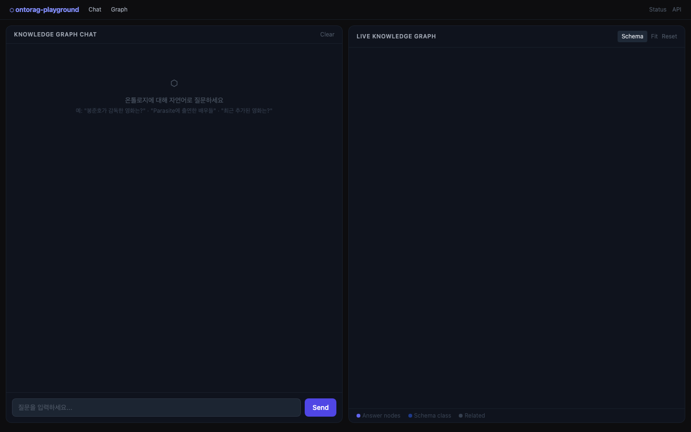
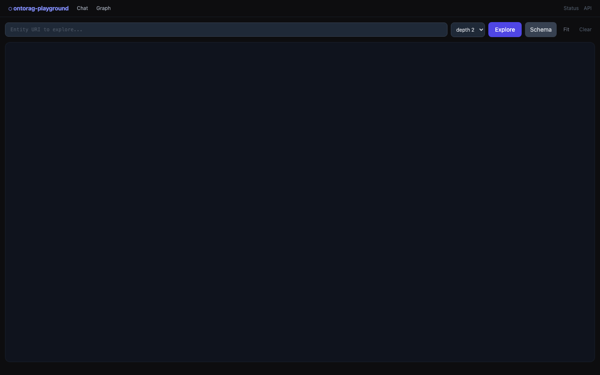

# ontorag-playground

> ontorag-playground is a domain-neutral, ontology-grounded knowledge-graph chatbot engine.
> You bring a schema (TBox) and data (ABox); it builds the graph, auto-links new data, and answers over it with an LLM (local or cloud).
> Movies are just the first reference dataset — swap the `domains/` folder to point it at anything.
> **Status: personal playground / WIP. Not a product.**

See [SPEC.md](SPEC.md) for full spec and stage-by-stage backlog.

## UI

| Chat (`/ui/chat`) | Graph Explorer (`/ui/graph`) |
|---|---|
|  |  |

**Chat** — left panel: natural-language Q&A over the knowledge graph (SSE streaming). Right panel: live graph that highlights cited entities after each answer.

**Graph Explorer** — freeform URI traversal with configurable depth; Schema button loads the full ontology class graph.

## Quick start

```bash
cp .env.example .env        # set LLM_PROVIDER, API keys, FUSEKI_URL
uv run playground serve     # → http://localhost:8200
```

## Domain swap

```
domains/
└── movie/          # first reference dataset (KMDB)
    ├── schema.ttl
    ├── mapping.yaml
    ├── acl_rules.yaml
    └── connector.py
```

Replace `domains/movie/` with your own `schema.ttl + mapping.yaml + acl_rules.yaml + connector.py`
and set `DOMAIN_DIR=domains/<your-domain>` in `.env`. The `engine/` core needs no changes.
